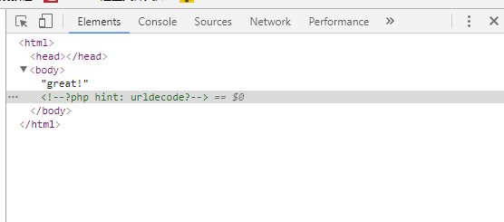

# urldecode
## **【原理】**

URL解码与编码

## **【目的】**

了解URL解码与编码的原理

## **【环境】**

Windows

## **【工具】**

百度，站长工具（URL解码/编码）

## **【步骤】**
**步骤1：**

首先打开题目，网页出现?me=

然后就试着访问/？me=1，网页出现you must be XMAN

接着又试了下访问/?me=XMAN，网页上显示的仍然是you must be XMAN

试了一遍又一遍......
终于，访问/?me=SJU,哇，出现了great!

**步骤2：**

查看网页源码，看到提示hint

猜测是用了urldecode函数对参数解密，因为浏览器会自动会参数解密一次，因此将url编码即可。

对参数SJU进行urlencode编码,发现编码之后还是SJU。

百度URI编码与解码的原理：urlencode()函数原理就是首先把中文字符转换为十六进制，然后在每个字符前面加一个标识符%。urldecode()函数与urlencode()函数原理相反，用于解码已编码的 URL 字符串，其原理就是把十六进制字符串转换为中文字符。

将参数SJU转换成十六进制%53%4A%55，对%53%4A%55再次进行urlencode编码得到%2553%254A%2555

**步骤3：**

访问/?me=%2553%254A%2555得到flag

